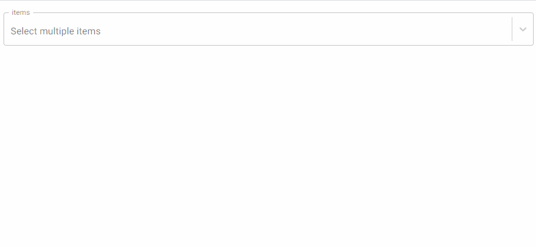

# react-sortable-select

> Sortable select input component for react. [View demo](https://eddielee394.github.io/react-sortable-select/).

[](https://www.npmjs.com/package/react-sortable-select) [](https://standardjs.com)




## Install

```bash
npm install react-sortable-select
```

## Usage
See example folder for more detailed implementation.

```jsx
import React, { Component } from 'react'
import SortableSelectInput from 'react-sortable-select'

const defaultItems = [
  {
    id: 1,
    label: `Item A`,
    class: 'bg-red',
    order: 1
  },
  {
    id: 2,
    label: `Item B`,
    class: 'bg-red',
    order: 2
  }
];

function App(){
    const [fieldValues, setFieldValues] = useState([])

    const handleChipChange = () => console.log('chip changed');

    const handleOnDragEnd = () => console.log('chip drag completed')

    return (
      <SortableSelectInput
        className='select-input'
        name='fieldValues'
        value={fieldValues}
        onChange={(value, index) =>
          handleChipChange('fieldValues', value, index)
        }
        placeholder='Select multiple items'
        textFieldProps={{
          label: 'items',
          variant: 'outlined',
          InputLabelProps: {
            shrink: true
          }
        }}
        options={defaultItems.map((item) => ({
          value: item.id,
          label: item.label,
          class: item.class
        }))}
        isMulti
        isSortable
        onDragEnd={handleOnDragEnd}
        fullWidth
        variant='fixed'
      />
)
}
```

#### Built on the shoulders of giants
- [Material UI](https://github.com/mui-org/material-ui)
- [React Select](https://github.com/jedwatson/react-select)
- [React Beautiful DND](https://github.com/atlassian/react-beautiful-dnd)


(MIT) © [eddielee394](https://github.com/eddielee394)
